# LAB3AREP

Tercer taller de la asignatura, en este se aplicaron conocimientos de HTTP, Sockets, HTML, JS, MAVEN, GIT.

### Prerrequisitos

Para ejecutar el laboratorio se debe tener instalado:

```
- Java
- Maven
- Git
```

### Instalación

Debe usarse el comando git clone para descargar el repositorio

```
git clone https://github.com/santiago-f20/LAB3AREP
```
Una vez descargado, en la carpeta del proyecto se debe ejecutar el siguiente comando para compilar el proyecto

```
mvn clean package
```
* Windows
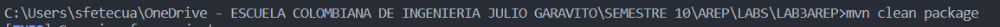
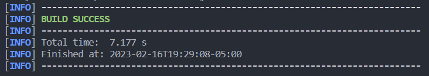

* Linux
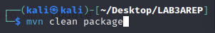
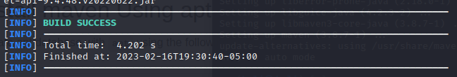

Para ejecutar el proyecto en Windows se debe usar el comando

```
java -cp target/classes;target/dependency/* edu.eci.arep.HttpServer
```
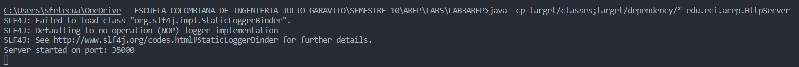
En Linux se debe usar el siguiente comando

```
java -cp target/classes:target/dependency/* edu.eci.arep.HttpServer
```
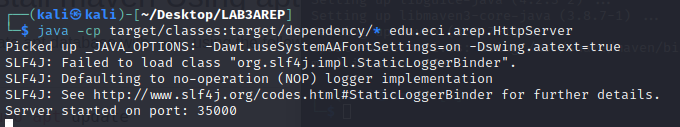
Una vez iniciado el servidor, se puede acceder a la pagina principal en el siguiente link

```
http://localhost:35000
```

### Uso

* Página Principal
Windows
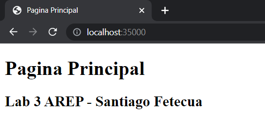
Linux
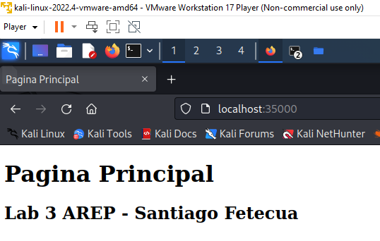

* Página hello
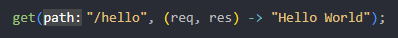
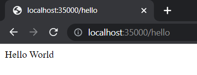
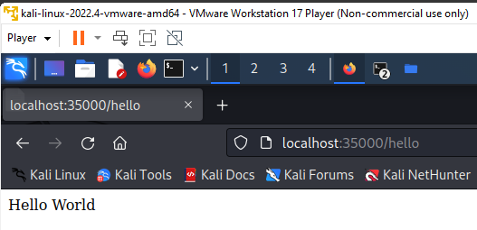

* Página hello con parametros
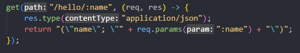
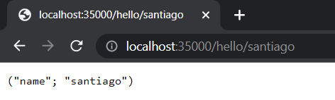
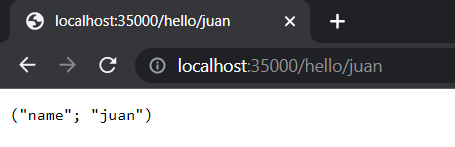
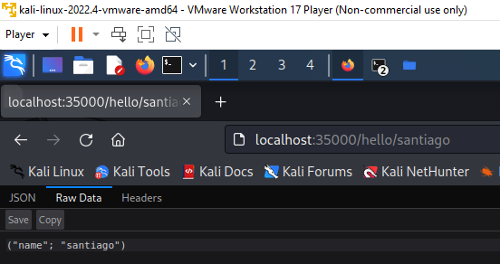

* Página sample.html
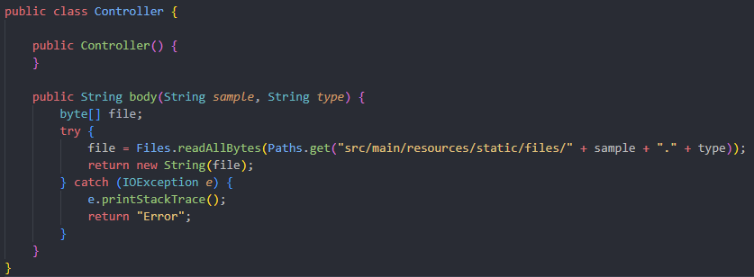
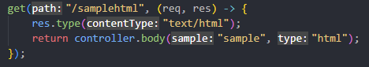
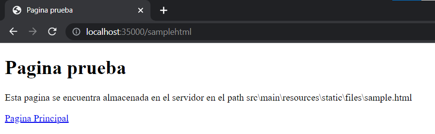
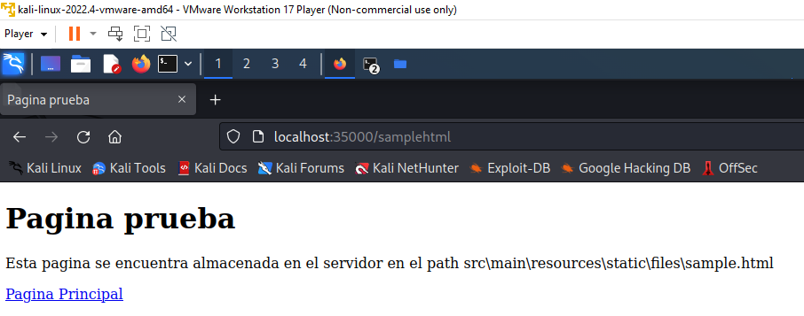

* Página sample.css
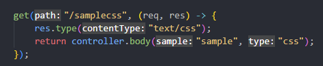
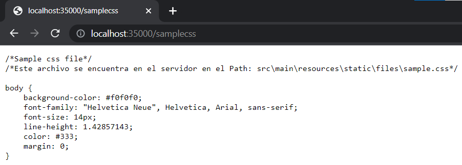
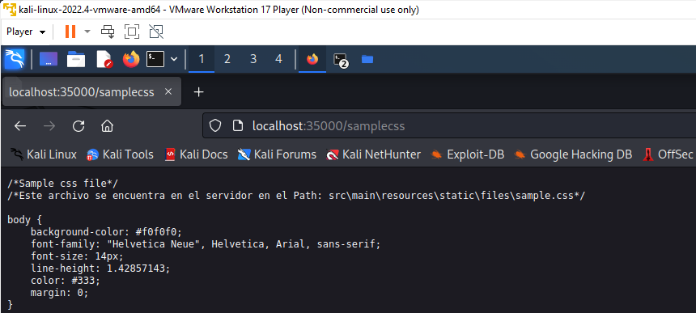

* Página sample.js
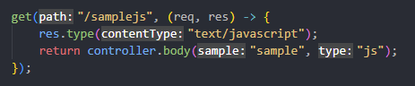
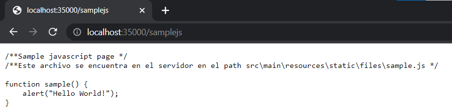
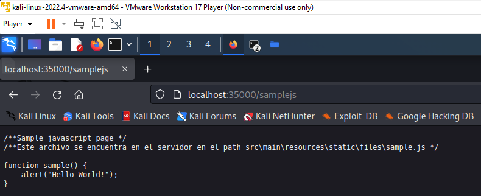

* Página sample.png
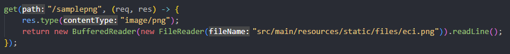
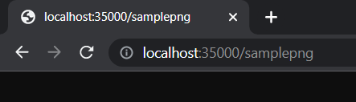

## Documentación

Para generar la documentación del proyecto se debe ejecutar el siguiente comando

```
mvn javadoc:javadoc
```
Para ver la documentación se debe abrir el archivo index.html que se encuentra en la carpeta target/site/apidocs

### Estructura del proyecto

```
.
│
├───src
│   ├───main
│   │   ├───java
│   │   │   └───edu
│   │   │       └───eci
│   │   │           └───arep
│   │   │                   Controller.java
│   │   │                   HttpServer.java
│   │   │
│   │   └───resources
│   │       └───static
│   │           │   index.html
│   │           │
│   │           └───files
│   │                   eci.png
│   │                   sample.css
│   │                   sample.html
│   │                   sample.js
│   │
│   └───test
│       └───java
│           └───edu
│               └───eci
│                   └───arep
│                           AppTest.java
```

## Construido con

* [Maven](https://maven.apache.org/) - Dependency Management
* [JAVA](https://www.java.com/es/download/) - Lenguaje de programación

## Autor

* **Santiago Fetecua** - [santiago-f20](https://github.com/santiago-f20)
